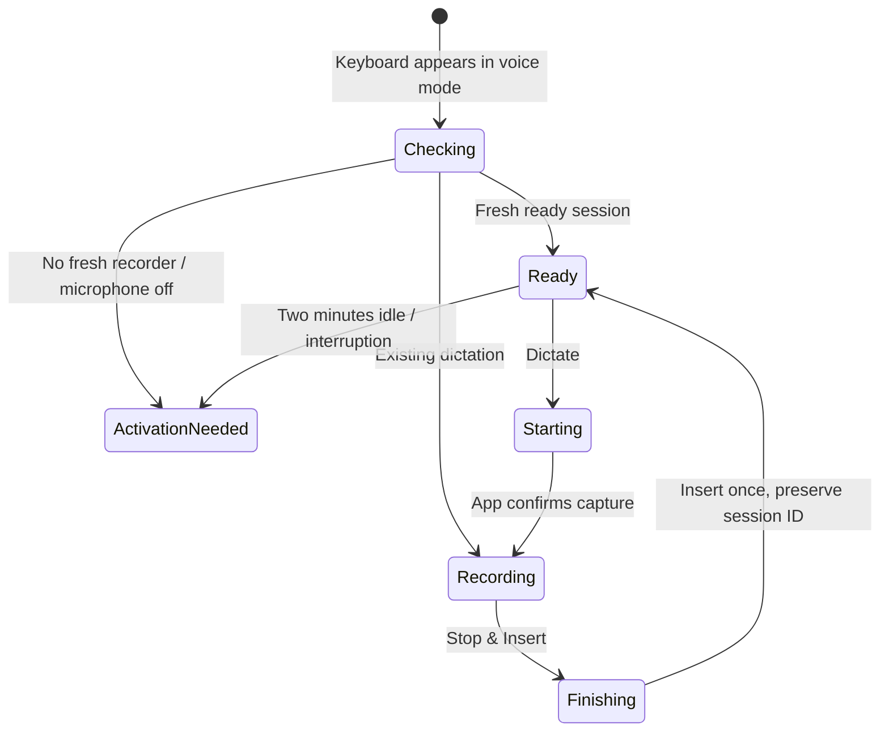

# Keyboard readiness

Saywick uses Parakeet for every new dictation and imported recording. Initial
microphone activation occurs in the app process. Recording shortcuts use AudioRecordingIntent plus
LiveActivityIntent. Cold activation opens Saywick with dynamic foreground
continuation because direct background activation failed on the test iPhone.
Dictation restarts while the microphone is ready stay in the background.

With Keep keyboard ready enabled, completing a dictation starts a 120-second idle
deadline. Beginning another dictation clears it; that recording can run longer than
two minutes. Completing it creates a new deadline. Clear, insertion, and ordinary
typing do not extend readiness. End, expiry, interruption, or failure releases the
microphone. Expiry preserves finished text for insertion. Idle audio is discarded.

The shared snapshot distinguishes microphone ownership from the optional idle
deadline. A recording has an active session with no deadline; an idle ready session
has both. A heartbeat older than five seconds makes the session unavailable to the
keyboard, even if its deadline has not passed. Old snapshot and History formats
remain decodable. Clearing an inactive shared snapshot clears both session fields.

Dictation is the default panel whenever the keyboard appears. ABC/Voice switches panels. QWERTY, single-use
Shift, numbers, punctuation, space, Return, held delete, and cursor dragging operate
without Full Access. Full Access is needed only for local dictation communication.
When inactive, Open Saywick uses a user-tapped SwiftUI URL action to request
`saywick://start?source=keyboard`. Rejection displays
inline fallback instructions. No refresh or timer opens the app.
A single primary action reflects access, freshness, preparation, recording, finalization,
meeting capture, and idle readiness. More expands auxiliary actions inline; keyboard controls never present modal alerts.

Physical-device release checks: complete a dictation and wait two minutes, confirm
orange microphone indicator disappears and text remains insertable; restart before
expiry and dictate beyond the old deadline; confirm Clear/typing does not extend
the idle deadline; verify interruption, locked phone, and End behavior. Also test
letters, Shift, symbols, delete, globe, and Return with Full Access disabled in Notes.

## Meeting sessions

Meeting mode has no readiness lease. It streams microphone audio to a retained WAV,
ignores keyboard dismissal, and has a four-hour recording limit. Stop closes the file
and saves a History entry without invoking Parakeet or cleanup. Transcription is an
explicit later History action. Clear and Restart are disabled during meetings.

A single AppModel.shared is used by both the SwiftUI scene and recording intents.
It owns long-lived command/interruption tasks. The startup task removes orphaned
Live Activities before new recording requests; repeated calls cannot start duplicate
observers or clean up an activity just created by a concurrent intent.

Background starts never request first-time microphone permission or download model
weights. They fail with setup guidance when prerequisites are missing. The recorder
requests its Live Activity before microphone activation and retains it until audio
capture has stopped. Both lock-screen and expanded Dynamic Island views offer a
Stop AudioRecordingIntent routed to the containing app.

## Device verification (2026-09-07)

On the connected iPhone, direct cold background activation returned “Session
activation failed,” including after a fresh install. Start shortcuts therefore use
system foreground continuation when activating an inactive microphone; meeting
starts use foreground continuation as well. This is not parity with Spokenly's
advertised no-switch activation.

The final signed build passed two physical-device smoke tests: meeting capture
started in the app, and a meeting started through the native Shortcuts Saywick
page from a terminated process. Both continued after pressing Home for five
seconds and saved successfully after returning and stopping. The 52 core tests,
three meeting app tests (including a 30-minute import fixture), and meeting UI
regression passed. Four-hour endurance, locked-screen capture, and the Live Activity
Stop button still need hands-on verification; the short background tests do not
establish those results.

## One-button flow and insertion acknowledgment

Insertion no longer sends Clear to the app while readiness is active. That command
rotated the session ID and could invalidate a quickly issued Start. Inserted IDs
remain tracked locally to prevent duplicate insertion. Each refresh re-evaluates
freshness and deadlines, even without a new revision. An issued action displays a
pending state until a newer snapshot confirms the transition (or five seconds
elapse). Opening the keyboard does not silently start audio capture.

## Dictionary

Users add correctly spelled words or phrases, one per line or through Add. Standalone
terms get conservative local spelling/sound matching before punctuation cleanup.
Exact `heard = preferred` aliases remain available. Corrections use no remote model;
this is a heuristic, not contextual ASR biasing. Close competing candidates remain
unchanged, and a small set of common name/word collisions is protected. Unusual
pronunciations and unlisted homonyms may still need explicit rules. Original History
transcripts remain available.

Add names from Contacts uses the system multi-selection picker, followed by a
review before adding. Only selected given/family/full names enter the dictionary;
no address-book enumeration, phone numbers, or emails are stored. Duplicates are
removed case-insensitively. Imported names can be edited/deleted in the word list.

The keyboard background is transparent to the system keyboard surface. Voice mode
requests 250 points and typing 286, with 44 more when the inline controls expand.
The bottom row is pinned six points from the extension edge; iOS owns the separate
globe/microphone area below the extension.
